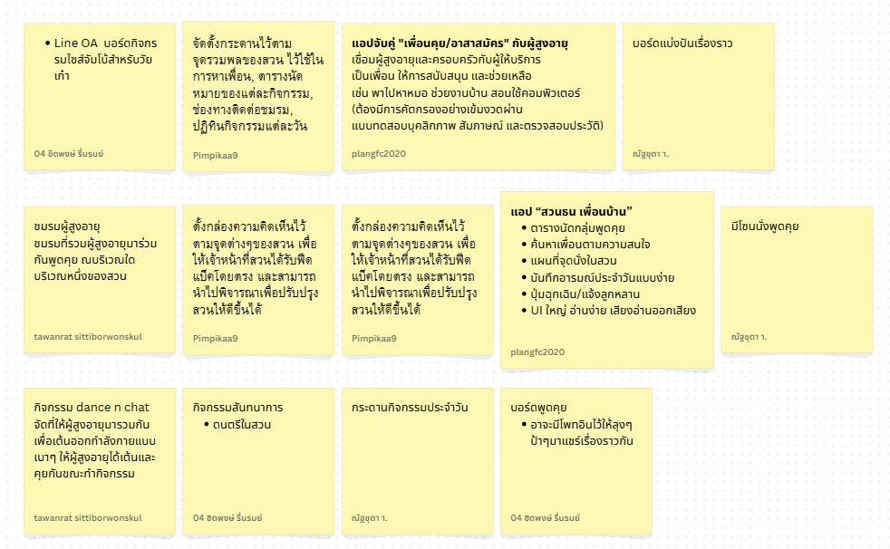
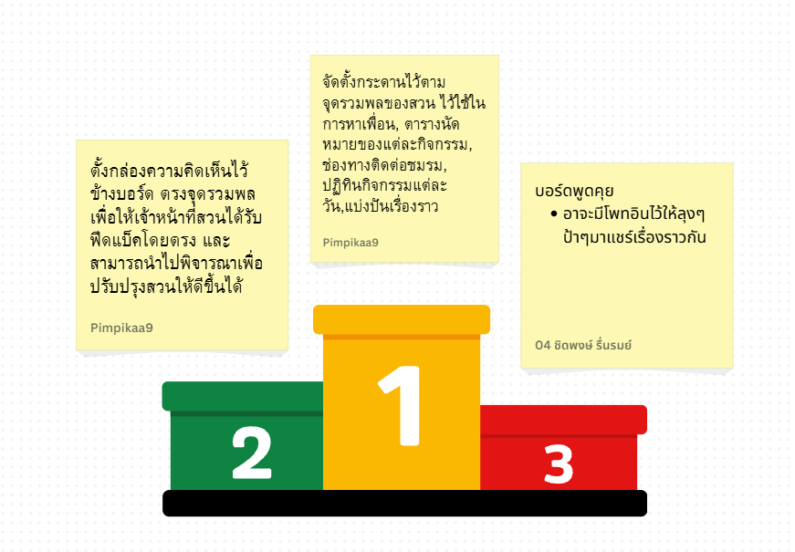
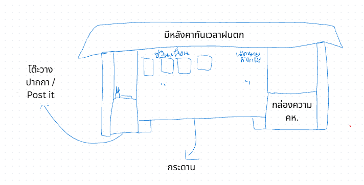
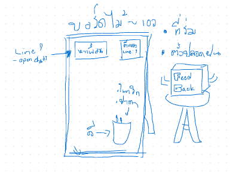

# Ideate

## How Might We (HMW)

เราจะเสริมสร้างสภาพแวดล้อมที่ดีและการออกแบบพื้นที่หรือกิจกรรมที่สนับสนุนให้ผู้สูงอายุได้รวมกลุ่มพูดคุยเพื่อบำบัดจิตใจและสร้างสังคมร่วมกันได้อย่างไร?

---

## 💡 Idea - ไอเดียแนวทาง

### 📌 Top Concepts

#### **Concept 1: บอร์ดสำหรับการหาเพื่อนและกิจกรรม**
จัดตั้งกระดานไว้ตามจุดรวมพลของสวน ใช้สำหรับ:
- หาเพื่อน
- ตารางนัดหมายของแต่ละกิจกรรม
- ช่องทางติดต่อชมรม
- ปฏิทินกิจกรรมแต่ละวัน
- แบ่งปันเรื่องราว

#### **Concept 2: กล่องรับข้อคิดเห็น**
ตั้งกล่องความคิดเห็นไว้ข้างบอร์ด ตรงจุดรวมพล เพื่อให้เจ้าหน้าที่สวนได้รับฟีดแบ็คโดยตรง และสามารถนำไปพิจารณาเพื่อปรับปรุงสวนให้ดีขึ้น

#### **Concept 3: บอร์ดพูดคุย**
อาจมีโพสต์อินไว้ให้ลุงๆป้าๆมาแชร์เรื่องราวกัน

### 🔄 การยุบรวมแนวคิด

ทีมได้สังเกตว่าทั้งสามแนวคิดสามารถจัดทำเป็นรูปแบบเดียวกันได้ จึงเลือก Features ที่น่าสนใจมาทำ Prototype

---

## 🎯 Prototype - ต้นแบบ

### ทิศทางแนวทาง

ยุบรวมทั้ง 3 ไอเดียเข้าด้วยกันเป็นโซลูชันเดียว: **กระดานบอร์ด** ณ จุดรวมพลของสวนธนบุรีรมย์

**จุดประสงค์:**
- ตอบโจทย์ความต้องการของผู้ใช้งานทั้ง 2 มิติ
  - **ด้านสุขภาพใจ** (จิตสังคม)
  - **ด้านสุขภาพกาย** (โครงสร้างพื้นฐาน)
- เป็นรูปธรรมตามเป้าหมาย Point of View (POV) ของกลุ่มเป้าหมาย

### ✨ Feature หลัก

- 💬 **สามารถแปะข้อความพูดคุยบนโพสต์อิท** เช่น การหาเพื่อนออกกำลังกาย
- 📍 **แบ่งโซนของโพสต์อิท** เช่น:
  - หาเพื่อน
  - กิจกรรม
  - แบ่งปันความรู้
- 📋 **กล่องรับข้อคิดเห็นเกี่ยวกับสวนสาธารณะ**
- ✏️ **เครื่องมือสำหรับการเขียน** ณ จุดบริการ

---

## 📐 Prototype Versions

### Version 1: บอร์ดวัยเก๋าแบบยึดมั่น (Fixed Board)

**ลักษณะ:** บอร์ดนี้จะไม่สามารถเคลื่อนที่ได้

**เหตุผล:** ในบริเวณส่วนนั้นมีโครงสร้างของบอร์ดเดิมที่ใช้ได้อยู่แล้ว เราจึงจะเข้าไปปรับปรุงให้บอร์ดนั้นกลับมามีชีวิตชีวาด้วยรูปแบบที่เราออกแบบ

---

### Version 2: บอร์ดวัยเก๋าแบบอิสระ (Mobile Board)

**ลักษณะ:** บอร์ดสามารถเคลื่อนย้ายได้

**ข้อดี:**
- ความง่ายต่อการเคลื่อนย้าย เมื่อพื้นที่ถูกจำกัด
- การเข้าถึงที่สะดวก เนื่องจากสามารถย้ายไปตามจุดต่างๆได้อย่างง่ายดาย
